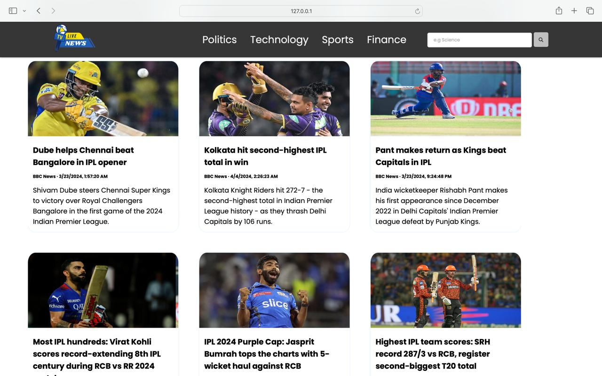
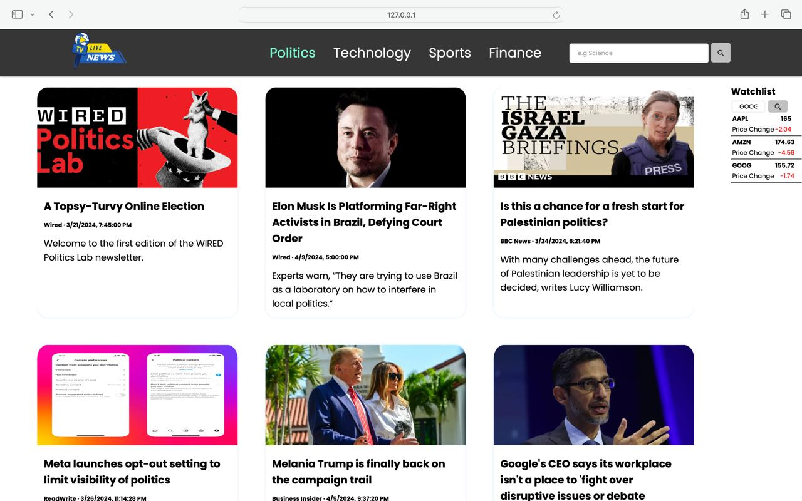

# NewsWebsite

This repository contains the source code for a NewsWebsite project.

## Description

The project is a web application that allows users to browse news articles based on different categories such as politics, technology, sports, and finance. It also provides a feature to search for news articles by entering keywords. Additionally, the website displays stock information and allows users to add stocks to a watchlist.

## Features

- Navigation bar with categories for news articles
- Search functionality to find news articles by keyword
- Display of news articles with images, titles, sources, and descriptions
- Integration with a stock API to display stock information
- Ability to add stocks to a watchlist

## Usage

To use the application, simply open the `index.html` file in a web browser. The navigation bar allows users to select different categories of news articles. Users can also search for news articles by entering keywords in the search bar. Stock information is displayed in a separate section, and users can add stocks to the watchlist by entering the stock symbol.

## Dependencies

The project relies on the following external APIs:
- [NewsAPI](https://newsapi.org/) for fetching news articles
- [Finnhub](https://finnhub.io/) for fetching stock information

You can create your own API for free by going on the above links and use it in place of mine by simply changing the 'API_KEY' and 'API_TOKEN' variables in the JavaScript file (script.js).

## Installation

No installation is required to run the project. However, you need an internet connection to fetch news articles and stock information from the APIs.

## Contributions

Contributions are welcome! If you want to contribute to this project, follow these steps:

Fork the repository.
Create a new branch for your feature or bug fix: git checkout -b feature/your-feature.
Make your changes and commit them: git commit -m 'Add a new feature'.
Push to the branch: git push origin feature/your-feature.
Create a pull request.
Please ensure your pull request is in line with the project's coding style and standards.

## License

This project is licensed under the [MIT License](LICENSE).

## Screenshots

